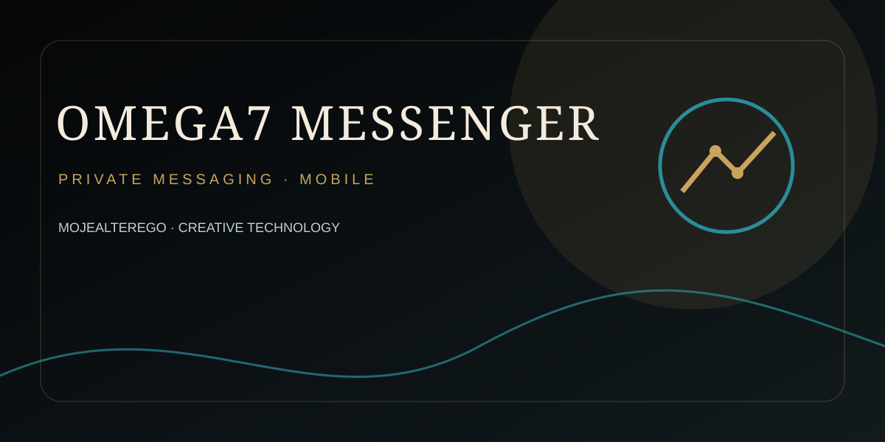

---

# Ω7 Messenger

Final source package **0.8.1** for the Ω7 Messenger Android project.

## Security posture

- Polish UI.
- AES-256-GCM for local data.
- Android Keystore for local/auth/device keys.
- Persistent 3-attempt access-code limit with application panic wipe.
- Strong biometric unlock when available.
- `FLAG_SECURE` and background lock.
- App backup disabled; cleartext HTTP disabled.
- Encrypted trusted-device and pairing stores.
- Bidirectional QR pairing with signed device identities and owner approval.
- Hard maximum of 7 devices.
- Fail-closed transport: no network sending until a real E2EE implementation is configured.

## Important

This repository must **not** be presented as a production-certified E2EE messenger yet. Production release still requires a concrete, reviewed E2EE protocol, backend/relay, multi-device synchronization, physical-device testing, fuzzing/concurrency/recovery testing, and independent security audit.

See:

- `RELEASE_STATUS.md`
- `SECURITY.md`
- `docs/25-final-release-gate.md`
- `docs/20-final-verification-gate.md`

## Build

The repository includes GitHub Actions configuration for tests, lint and APK builds. The local ChatGPT environment used to prepare this snapshot does not contain the Android SDK, ADB, or a complete Gradle wrapper, so no local APK build is claimed here.
